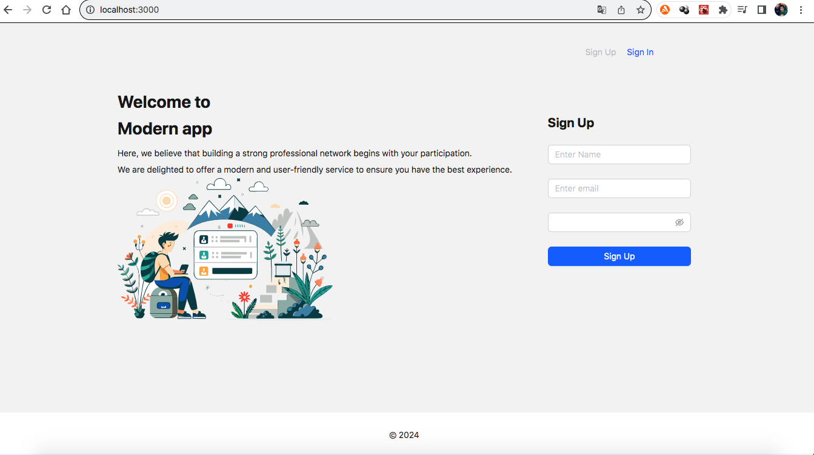

# Moderate Abstraction

Moderate Abstraction is a versatile project designed to provide a foundation for scalable and modular software development. It incorporates best practices for authentication, authorization, and component structure.

## Getting Started

Follow the instructions in the README to set up and run the project locally.

---
**minimal** code base for creating apps to do **locally**.

## Stack

- 🦙 Inference: [React](https://legacy.reactjs.org/docs/getting-started.html)
- 💻 DB: [MongoDB](https://www.mongodb.com/cloud/atlas/)
- 🖼️ App logic: [NEST](https://docs.nestjs.com/)

## Change Configurations
go to /backend/src/app.module.ts
add your Databases mongoDB url
should be  [mongodb+srv]
Start the  database (you need mongodb). 
See [here](https://www.mongodb.com/cloud/atlas/efficiency?utm_source=google&utm_campaign=search_gs_pl_evergreen_atlas_general-phrase_prosp-brand_gic-null_ww-multi_ps-all_desktop_eng_lead&utm_term=mongodb&utm_medium=cpc_paid_search&utm_ad=p&utm_ad_campaign_id=11295578158&adgroup=116363205048&cq_cmp=11295578158&gad_source=1&gclid=CjwKCAiAiP2tBhBXEiwACslfngFnaFlpMoVQscrI77uHbQQ5zSei0u0GdQmC0EF-Gfk_Zi0X2UgFxxoCa_0QAvD_BwE) for other options information: 
mongoDB

## How to get started

```bash
git clone https://github.com/zvHristov/moder-app
```

2. Install backend dependencies:

```bash
cd backend/
npm install
npm start run dev:start
```

3. Install frontend dependencies:

```bash
cd frontend
npm install
npm start
```
4. Create a backend/ `.env` file in the root directory and add your key:

```plaintext
JWT_REFRESH_SECRET=''
JWT_ACCESS_SECRET = ''
MONGO_URI=''
SECRET=''
```
## Additional Use Cases
In the frontend, I adopted a Feature Sliced Design, organizing components based on features rather than traditional type-based directories. This approach enhances modularity and scalability. Each feature slice contains its components, styles, and logic, promoting a clear separation of concerns and facilitating future expansions.

## Discussion and Contribution

The project prioritizes security through robust authentication and authorization mechanisms. Utilizing JSON Web Tokens (JWT) ensures secure user authentication and authorization on the server. The implementation includes features such as access and refresh tokens, preventing unauthorized access and enhancing overall system security. Passwords are securely hashed using the Argon2 algorithm, reinforcing the protection of sensitive user data. By following industry best practices, the project minimizes security risks and lays a solid foundation for future enhancements.

Feel free to modify these descriptions based on the specific details and nuances of your project. If you have more specific questions or need assistance with other aspects of your project description, feel free to ask!

## Preview
Please ensure that the server is running and has been started on the host.





## Design
This Login was built using [Figma File](https://www.figma.com/file/c9UMtlcBQSnjnh81FusKBI/Login---UX%2FUI-Design-%7C-Free-UI-KIT-(Community)?type=design&node-id=0-1&mode=design&t=40NYSsuVlaJb9ptE-0).

## Key Features

- **Feature Sliced Design:** Organized components based on features for enhanced modularity and maintainability.

- **Secure Authentication:** Utilizes JSON Web Tokens (JWT) for secure user authentication with access and refresh tokens.

- **Robust Authorization:** Implements robust authorization mechanisms to control user access based on roles and permissions.

- **Argon2 Password Hashing:** Enhances security by securely hashing passwords using the Argon2 algorithm.

## Extensibility

Moderate Abstraction is built with extensibility in mind, allowing easy adaptation to the evolving needs of a business model. The project can be expanded:

- **New Features:** Easily integrate new features by adding feature slices with dedicated components, styles, and logic.

- **Business Logic Enhancements:** Extend and enhance business logic by updating existing modules or introducing new ones.

- **Scalability:** Accommodate growth by scaling components and adjusting the architecture to meet increased demands.

**Note:** This README serves as an introduction to the project. For detailed information on installation, usage, and contributions, refer to the project documentation.

Feel free to explore, contribute, and adapt Moderate Abstraction to suit the specific requirements of your software development projects.

## MIT License

Copyright (c) 2024 Zvezdomir